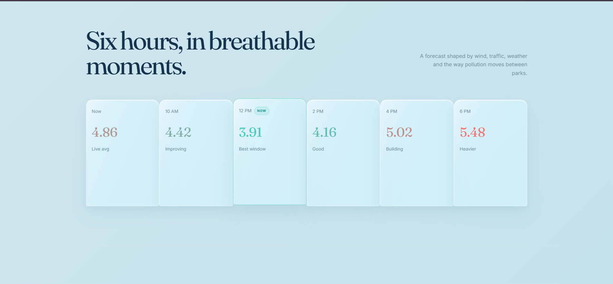
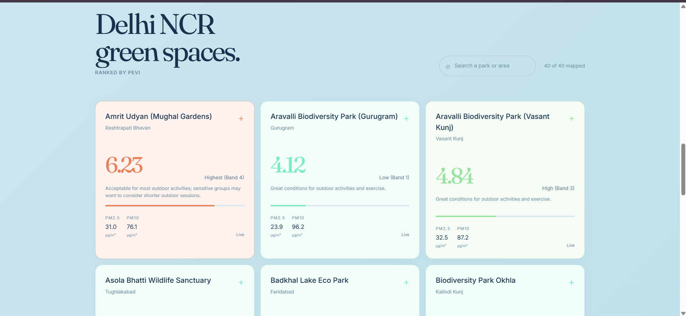
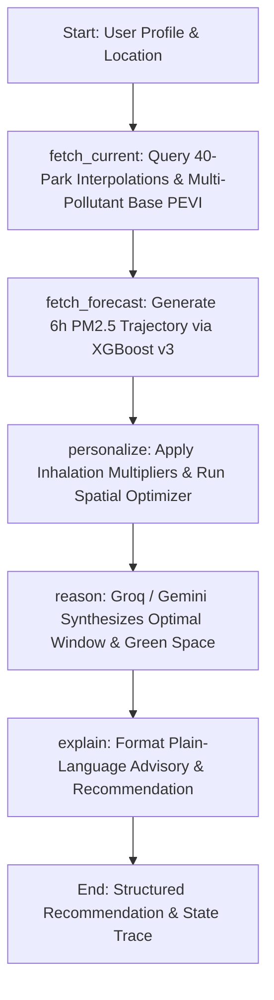

# HawaGuide o(*￣▽￣*)o

> **Hyperlocal Air Quality Intelligence & Personalized Exposure Vulnerability Index (PEVI) for Delhi NCR**

---

## Why HawaGuide?

India's official National Air Quality Index (NAQI) reports only the single worst pollutant on a given day (the sub-index maximum principle), ignoring the concurrent burden of the other 5 criteria pollutants. 

HawaGuide's **Personalized Exposure Vulnerability Index (PEVI)** instead integrates the cumulative biological health-risk contribution from all 6 regulatory pollutants measured across Delhi NCR (**$\text{PM}_{2.5}$, $\text{PM}_{10}$, $\text{NO}_2$, $\text{SO}_2$, $\text{O}_3$, $\text{CO}$**) simultaneously. A location with multiple moderately-elevated pollutants is correctly identified as riskier than standard single-pollutant AQI would indicate.

---

## Visual Overview & UI Walkthrough

### 1. Interactive Liquid Glass Main Landing Page

*Real-time Delhi NCR air quality atmosphere with live network PEVI widget, 6-hour trend preview, and quick explainer trigger.*

### 2. Hyperlocal Green Spaces & Personalized PEVI

*40 Delhi NCR parks ranked by health-weighted exposure index with real-time pollutant levels, tailored risk bands, and plain-language guidance.*

### 3. Diurnal Air Quality Forecast Rail

*6-hour dynamic forecast timeline highlighting optimal breathable windows for outdoor activity across the region.*

### 4. Conversational Air Quality Agent ("Hawa")

*Sequential multi-turn assistant with structured health profile clarification, interactive Leaflet map picker, out-of-region boundary protection, and localStorage profile memory.*

---

## System Overview

HawaGuide is an end-to-end environmental intelligence platform built on five core pillars:

1. **Continuous Regulatory Ingestion**: Ingests multi-pollutant measurements from regulatory monitoring networks (CPCB, DPCC, IMD, IITM, UPPCB, HSPCB) via the OpenAQ v3 API and concurrent weather parameters via Open-Meteo, persisting spatial observations in PostGIS.
2. **Geostatistical Kriging to Green Spaces**: Uses Ordinary Kriging with empirical variogram modeling to interpolate continuous pollution surfaces across 40 urban parks from a 24-hour rolling mean baseline.
3. **5-Factor Personalized Vulnerability (PEVI)**: Adjusts raw multi-pollutant ambient risk using individual demographic, physiological, respiratory/cardiac, and activity-duration multipliers.
4. **Multi-Horizon Trajectory Forecasting**: Generates 6-hour predictive trajectories using a 100% XGBoost v3 multi-horizon model conditioned on autoregressive lags and diurnal meteorology (empirically selected over a hybrid LSTM blend).
5. **Conversational Intelligence & Guardrails**: An autonomous LangGraph agent powered by **Groq (`openai/gpt-oss-120b`)** as primary high-speed engine and **Google Gemini** as fallback, featuring a 6-step sequential clarification flow, invalid response recovery, casual closing interception, `localStorage` profile memory, and Delhi NCR boundary protection.

---

## Project Architecture

```text
HawaGuide/
├── README.md                           # Project Documentation, Methodology & Audits
├── .gitignore                          # Repository ignores (venv, .env, __pycache__)
├── .github/
│   └── workflows/
│       └── ci.yml                      # GitHub Actions CI matrix with PostGIS 15 service
├── docs/
│   ├── FUTURE_IMPROVEMENTS.md          # Categorized, Reasoned Deferred Architecture Items
│   └── screenshots/                    # UI component walkthrough screenshots
├── backend/
│   ├── .env                            # Database, Groq, Gemini & Sentry credentials
│   ├── .env.example                    # Environment variable template
│   ├── requirements.txt                # Python dependencies
│   ├── app/                            # FastAPI backend service
│   │   ├── __init__.py
│   │   └── main.py                     # FastAPI routes, geocoding, boundary check, /agent/ask
│   ├── data_pipeline/                  # Ingestion & PostGIS management
│   │   ├── __init__.py
│   │   ├── schema.sql                  # PostGIS DDL schema & spatial indexes
│   │   ├── setup_db.py                 # Automated schema & extension initializer
│   │   ├── openaq_stations.py          # Active Delhi NCR station discovery & ingestion
│   │   ├── openaq_readings.py          # 90-day hourly multi-pollutant measurements sync
│   │   ├── weather_ingest.py           # Historical & live Open-Meteo weather ingestion
│   │   └── seed_ci_data.py             # Deterministic test database seeder for CI runs
│   ├── ml/                             # Geostatistical & ML models
│   │   ├── __init__.py
│   │   ├── kriging.py                  # Ordinary Kriging, LOOCV & 40-Park PEVI estimation
│   │   ├── pevi.py                     # 6-Pollutant PEVI calculation & risk banding
│   │   ├── train_and_save_forecaster.py# Multi-horizon model training & validation pipeline
│   │   ├── forecast_engine.py          # Production 100% XGBoost v3 inference engine
│   │   ├── optimizer.py                # Multi-objective spatial location optimizer
│   │   ├── agent_graph.py              # LangGraph 5-node StateGraph workflow
│   │   └── models/                     # Serialized model artifacts & evaluation metadata
│   │       ├── xgboost_forecast_v3.joblib
│   │       ├── lstm_forecast_v3.pt
│   │       ├── lstm_scalers.joblib
│   │       └── model_metadata.json
│   └── tests/                          # 29 Automated unit, spatial & agent test suites
│       ├── test_kriging_variation.py
│       ├── test_forecast_engine.py
│       ├── test_agent_sequential_flow.py
│       ├── test_agent_session_memory.py
│       ├── test_agent_saved_profile.py
│       ├── test_agent_boundary_check.py
│       ├── test_agent_closing_ack.py
│       ├── test_agent_degraded_mode.py
│       ├── test_agent_genuine_extraction.py
│       ├── test_agent_location_required.py
│       ├── test_agent_no_contradiction.py
│       ├── test_agent_personalization_consistency.py
│       └── test_agent_tiered_logic.py
└── frontend/                           # React 19 / TypeScript / Vite / Leaflet UI
    ├── package.json
    ├── vite.config.ts
    ├── index.html
    └── src/
        ├── main.tsx
        ├── App.tsx                     # Main layout, hero, park cards, forecast rail
        ├── index.css                   # Liquid Glass design tokens & responsive styling
        ├── components/
        │   ├── AgentPanel.tsx          # Conversational chat UI & localStorage memory
        │   └── MapPickerModal.tsx      # Leaflet interactive map picker modal
        ├── api/                        # Backend REST fetch clients
        ├── utils/                      # PEVI color bands, risk calculations & helpers
        └── types/                      # TypeScript definitions
```

---

## Quickstart & Execution

### 1. Database Setup
Ensure PostgreSQL 15+ with PostGIS 3.3+ is installed and running. Create `backend/.env` (see `backend/.env.example`) and initialize the schema:
```powershell
.\venv\Scripts\python.exe backend/data_pipeline/setup_db.py
```

### 2. Discover Stations & Ingest OpenAQ / Weather Data
```powershell
# Discover and register 14 active monitoring stations across Delhi NCR
.\venv\Scripts\python.exe backend/data_pipeline/openaq_stations.py

# Ingest 90 days of hourly multi-pollutant readings (~144,000 measurements)
.\venv\Scripts\python.exe backend/data_pipeline/openaq_readings.py

# Ingest concurrent meteorological variables (wind, humidity, rain, temp)
.\venv\Scripts\python.exe backend/data_pipeline/weather_ingest.py
```

### 3. Run Kriging Validation & 40-Park Interpolation
```powershell
.\venv\Scripts\python.exe backend/ml/kriging.py
```

### 4. Compute PEVI Scores & Rank 40 Parks
```powershell
.\venv\Scripts\python.exe backend/ml/pevi.py
```

### 5. Train & Evaluate Multi-Horizon Forecaster
```powershell
.\venv\Scripts\python.exe backend/ml/train_and_save_forecaster.py
```

### 6. Launch Backend & Frontend Services

**Terminal 1: FastAPI REST Backend**
```powershell
.\venv\Scripts\uvicorn.exe backend.app.main:app --reload --port 8000
```

**Terminal 2: React / Vite Frontend**
```powershell
cd frontend
npm install
npm run dev
```
Open `http://localhost:5173` in your browser.

### 7. Run Automated Regression Test Suite (29 Tests)
```powershell
.\venv\Scripts\python.exe -m unittest discover -s backend/tests -v
```

---

## 40 Configured Delhi NCR Green Spaces

Air quality estimates and Personalized Exposure Vulnerability Index scores are computed for 40 named urban green spaces and persisted in the PostGIS `interpolated_locations` table:

1. **Lodhi Garden** (Central Delhi)
2. **Sunder Nursery** (Nizamuddin / South East)
3. **Nehru Park** (Chanakyapuri)
4. **Deer Park** (Hauz Khas)
5. **District Park Hauz Khas** (Hauz Khas)
6. **Sanjay Van** (Qutub Institutional Area)
7. **Garden of Five Senses** (Said-ul-Ajaib / Saket)
8. **Buddha Jayanti Park** (Central Ridge)
9. **Central Park** (Connaught Place)
10. **India Gate Lawns** (Central Delhi)
11. **Amrit Udyan (Mughal Gardens)** (Rashtrapati Bhavan)
12. **Millennium Indraprastha Park** (Sarai Kale Khan)
13. **Japanese Park (Swarna Jayanti)** (Rohini Sector 10)
14. **Rohini District Park** (Rohini Sector 9)
15. **Yamuna Biodiversity Park** (Wazirabad)
16. **Aravalli Biodiversity Park** (Vasant Kunj)
17. **Aravalli Biodiversity Park** (Gurugram)
18. **Leisure Valley Park** (Sector 29, Gurugram)
19. **Tau Devi Lal Biodiversity Park** (Sector 52, Gurugram)
20. **Biodiversity Park Okhla** (Kalindi Kunj)
21. **Okhla Bird Sanctuary** (Noida / Delhi Border)
22. **Meghdootam Park** (Sector 50, Noida)
23. **Noida Biodiversity Park** (Sector 91, Noida)
24. **Mansarovar Park** (Sector 38A, Noida)
25. **Smriti Van** (Sector 49, Noida)
26. **Asola Bhatti Wildlife Sanctuary** (Tughlakabad)
27. **Qudsia Bagh** (Civil Lines)
28. **Roshanara Bagh** (Shakti Nagar)
29. **Shalimar Bagh District Park** (North Delhi)
30. **Talkatora Gardens** (President's Estate)
31. **Mahavir Jayanti Park** (Ridge Road)
32. **National Rose Garden** (Chanakyapuri)
33. **Jahanpanah City Forest** (Alaknanda / Greater Kailash)
34. **Sanjay Lake Park** (Mayur Vihar)
35. **Swarna Jayanti Park Indirapuram** (Ghaziabad)
36. **City Forest Ghaziabad** (Raj Nagar Extension)
37. **Town Park Faridabad** (Sector 12, Faridabad)
38. **Badkhal Lake Eco Park** (Faridabad)
39. **Surajkund Green Complex** (Faridabad / Delhi Border)
40. **Coronation Park** (Burari Road / Kingsway Camp)

---

## LangGraph Agent Layer & Conversational Intelligence

The intelligent agent layer integrates geostatistical interpolation, ML forecasting, personalized risk modeling, and LLM reasoning into a cyclical **LangGraph StateGraph** workflow:



### 1. Personalization Multipliers
* **`age_multiplier`**:
  * `1.3` for **children** (<18, higher ventilation-to-body-mass ratio and developing airways) or **elderly** (65+, diminished cardiovascular elasticity).
  * `1.0` for **adults** (general baseline).
* **`condition_multiplier`**:
  * `1.5` for underlying **respiratory** (asthma, COPD) or **cardiac** conditions.
  * `1.0` for **healthy** individuals.
* **`smoker_multiplier`**:
  * `1.25` for tobacco smokers, accounting for compromised mucociliary clearance and chronic baseline airway inflammation.
* **`activity_multiplier`**:
  * **Rest / Sedentary (1.0x)**: Basal minute-ventilation rate ~6-8 L/min.
  * **Moderate Exercise (1.3x)**: Brisk walking, light cycling (~20-30 L/min).
  * **Vigorous Exercise (1.6x)**: Running, high-intensity cardio (~45-65+ L/min), shifting to oral inhalation that bypasses nasal filtration *(US EPA Exposure Factors Handbook, Chapter 6)*.
* **`duration_multiplier`**:
  * `(1 + 0.15 * duration_hours)` accounts for cumulative inhaled dose over time.

> [!NOTE]
> **Epidemiological Attribution & Literature Basis**:
> These multipliers are informed by:
> 1. US EPA *"Particle Pollution Exposure"* clinical references on sensitive subpopulations.
> 2. Time-series epidemiological studies on ambient air pollution and vulnerable group hospitalizations (e.g., a Southwest China multi-city time-series study on air pollution and elderly asthma hospitalization, *PMC10859495*).
> 
> *Disclaimer*: While grounded in EPA sensitive-group categorizations and published relative-risk ranges, these specific constants (1.3, 1.5, 1.25, 0.15/hr) represent HawaGuide's own engineering and risk-weighting framework for comparative green space ranking, not directly published universal constants.

---

### 2. Multi-Objective Spatial Location Optimizer

For any user starting coordinate (lat, lon), the optimizer balances **environmental pollution risk** against **travel distance**:

1. **Geodetic Proximity via PostGIS**:
   Computes geodesic distances from user coordinates to all 40 parks using PostGIS `ST_Distance(location::geography, ST_SetSRID(ST_MakePoint(lon, lat), 4326)::geography)`.
2. **Min-Max Feature Normalization**:
   Normalizes both `Personalized_PEVI` and `distance_km` across all 40 candidate parks to a `[0, 1]` scale:
   ```text
   norm_risk     = (risk - min(risk)) / (max(risk) - min(risk))
   norm_distance = (dist - min(dist)) / (max(dist) - min(dist))
   ```
3. **Composite Trade-Off Scoring**:
   ```text
   Score = alpha * norm_risk + (1 - alpha) * norm_distance    (lower is better)
   ```
   * `alpha = 1.0` $\to$ Purely lowest pollution risk.
   * `alpha = 0.0` $\to$ Purely closest geographic proximity.
   * `alpha = 0.5` $\to$ Balanced health-travel trade-off.

---

### 3. Structured Endpoint: `POST /agent/recommend`

Used for programmatic / non-conversational queries where all parameters are provided up-front.

#### Request Schema:
```json
{
  "lat": 28.6328,
  "lon": 77.2197,
  "age_group": "elderly",
  "conditions": ["asthma"],
  "smoker": false,
  "planned_activity": "moderate",
  "duration_hours": 2.0,
  "alpha": 0.6
}
```

#### Response Structure:
Returns the final plain-language recommendation text, the optimal time window in the next 6 hours, top recommended park, compound multiplier breakdown, complete 5-node state trace (with input/output snapshots at each node for auditability), and the standard medical disclaimer.

---

### 4. Conversational Endpoint: `POST /agent/ask` (Sequential Clarification & Guardrails)

A natural-language conversational interface that maintains per-session slot memory across turns without forcing users into rigid forms.

#### 6-Step Sequential Clarification Flow

Rather than overwhelming the user with a combined question for all missing variables, Hawa asks for missing fields **one at a time in a fixed, logical sequence**:
$$\text{age\_group} \longrightarrow \text{conditions} \longrightarrow \text{smoker} \longrightarrow \text{planned\_activity} \longrightarrow \text{duration\_hours} \longrightarrow \text{location}$$

```text
Turn 1  → User: "Find me a place for a morning jog"
          Hawa: "Could you share your age or age group (e.g. 25, child, adult, elderly)?" (status: "clarifying")
Turn 2  → User: "28"
          Hawa: "Got it, categorizing you as adult (18-64). Do you have any respiratory or heart conditions (like asthma, COPD, or cardiac issues)?"
Turn 3  → User: "None"
          Hawa: "Do you smoke tobacco? (yes / no)"
Turn 4  → User: "No"
          Hawa: "How long do you plan to be outside? (e.g. 30 mins, 1 hour, 2 hours)"
Turn 5  → User: "45 minutes"
          Hawa: "Where are you located in Delhi NCR?"
Turn 6  → User: "Connaught Place" (or map pin / GPS click)
          Hawa: Full personalized park recommendation & optimal time window (status: "complete")
```

#### Core Conversational Features & Guardrails

1. **Age-Bracket Transparency**: When age is supplied (e.g., `"28"` or `"72"`), Hawa explicitly acknowledges the mapped category (`"Got it, categorizing you as adult (18-64)"` or `"elderly (65+)"`) before moving to the next question.
2. **Invalid Response Recovery**: If the user provides an unparseable response to a specific question (e.g., replying `"maybe"` when asked for smoker status), Hawa re-prompts specifically for that field with explicit guidance.
3. **Casual Closing & Acknowledgment Interception**: Sending polite acknowledgments (`"Thank you"`, `"thanks"`, `"ok"`, `"got it"`, `"bye"`) after a completed recommendation receives a warm closing reply (`"You're welcome! Feel free to ask again whenever you're heading out."`) and does **not** accidentally re-trigger the clarification sequence.
4. **Delhi NCR Boundary Check (`is_within_delhi_ncr`)**:
   - Resolved coordinates are verified against the operational boundary: $\text{lat} \in [28.0, 29.2], \text{lon} \in [76.5, 77.9]$.
   - If outside the area (e.g. Jaipur, Mumbai), Hawa does **not** recommend an absurd 200+ km Delhi park trip. Instead, it responds honestly:
     *"I'm currently built specifically for Delhi NCR and don't have real air quality data for [detected place name] yet — I'll be able to help when I expand to your city!"*
5. **Reverse-Geocoded Location Display**: Coordinates captured via GPS or the map picker are reverse-geocoded via Nominatim before display, ensuring user chat bubbles and replies display clean place names (e.g. `"Lodhi Colony, New Delhi"` or `"Jaipur, Rajasthan"`) rather than raw floats like `"28.5931, 77.2197"`.
6. **Multi-Modal Location Selection**: The UI offers three synchronized location input methods:
   - **Use my current location**: Direct browser GPS geolocation.
   - **Pick on map**: Leaflet interactive map modal with OSM tiles and custom glass pin.
   - **Manual search / text**: Real-time Nominatim geocoding.
7. **Privacy-First `localStorage` Profile Memory**:
   - Once a user profile (`age_group`, `conditions`, `smoker`, `planned_activity`) is collected, it is saved in browser `localStorage` (`hawaguide_profile`).
   - On future visits, Hawa skips repetitive health questions and asks only for transient session variables (`duration_hours` and `location`).
   - Includes a prominent **"Not you? Reset my info"** button to immediately clear stored profile data without requiring server-side user accounts or passwords.

---

### 5. Dual LLM Provider Architecture (Groq + Gemini Fallback)

HawaGuide utilizes a provider-neutral orchestration architecture:

* **Primary Engine**: **Groq (`openai/gpt-oss-120b`)** provides high-throughput inference (low latency, high token allowance).
* **Secondary Fallback**: **Google Gemini (`gemini-3.6-flash` / `gemini-1.5-flash`)** activates automatically if Groq encounters network errors, timeouts, or quota limits.
* **Graceful Degradation**: If all upstream LLM calls fail, the system sets `extraction_degraded: true` and falls back cleanly to deterministic rule-based clarification questions without crashing.

---

## Technical Deep-Dive & ML/Geostatistical Methodology

### 1. Core Geostatistical Modeling: Ordinary Kriging

HawaGuide employs **Ordinary Kriging (OK)** using a spherical variogram model to interpolate continuous concentration fields for 6 key air pollutants:
- **Particulate Matter**: PM2.5, PM10
- **Gaseous Pollutants**: NO2, SO2, O3, CO

#### Cross-Validation Methodology (LOOCV)
Model performance is evaluated via **Leave-One-Station-Out Cross-Validation (LOOCV)** across **100 randomly sampled hourly timestamps** spanning the 90-day historical archive (~1,400 individual model fits):

| Pollutant | Sample Runs | Avg Stations Reporting | Mean Actual Value | Mean LOOCV RMSE | RMSE Std. Dev (σ) | Mean LOOCV MAE | Relative Error |
|---|---|---|---|---|---|---|---|
| **PM2.5** | 100 | 13.1 | 44.78 µg/m³ | **25.88 µg/m³** | ± 35.91 | 18.33 µg/m³ | **54.7%** |
| **PM10** | 100 | 13.1 | 133.17 µg/m³ | **61.65 µg/m³** | ± 39.91 | 45.50 µg/m³ | **49.0%** |
| **NO2** | 100 | 13.3 | 29.31 µg/m³ | **22.12 µg/m³** | ± 10.21 | 17.02 µg/m³ | **75.2%** |
| **SO2** | 100 | 7.5 | 18.62 µg/m³ | **13.15 µg/m³** | ± 6.74 | 11.04 µg/m³ | **69.0%** |
| **O3** | 100 | 13.1 | 27.96 µg/m³ | **21.83 µg/m³** | ± 15.57 | 16.63 µg/m³ | **79.1%** |
| **CO** | 100 | 13.4 | 0.85 mg/m³ | **0.56 mg/m³** | ± 0.24 | 0.42 mg/m³ | **67.1%** |

---

### 2. Personalized Exposure Vulnerability Index (PEVI) Formulation

The **Personalized Exposure Vulnerability Index (PEVI)** is a continuous, multipollutant exposure and health vulnerability metric calculated across all 40 urban green spaces in Delhi NCR. It quantifies the combined excess health risk from concurrent inhalation of 6 key air pollutants.

#### Published Base Formulation: Canada AQHI (Stieb et al. 2008)
The foundational risk-additive mathematical structure directly adopts the peer-reviewed **Air Quality Health Index (AQHI)** methodology established by Health Canada and Environment Canada:

> **Citation**: Stieb, D. M., Burnett, R. T., Smith-Doiron, M., Brion, O., Shin, H. H., & Economou, V. (2008). *"A New Multipollutant, No-Threshold Air Quality Health Index Based on Short-Term Mortality Risk in Canadian Cities."* Journal of the Air & Waste Management Association, 58(3), 435–450. [DOI: 10.3155/1047-3289.58.3.435](https://doi.org/10.3155/1047-3289.58.3.435)

The published 3-pollutant base formula is:

$$
\text{AQHI}_{\text{base}} = \left(\frac{10}{10.4}\right) \times 100 \times \left[ \left(e^{0.000537 \times \text{O}_3} - 1\right) + \left(e^{0.000871 \times \text{NO}_2} - 1\right) + \left(e^{0.000487 \times \text{PM}_{2.5}} - 1\right) \right]
$$

* **Input Units**: $\text{O}_3$ and $\text{NO}_2$ in $\text{ppb}$; $\text{PM}_{2.5}$ in $\mu\text{g/m}^3$.
* **Unit Conversion**: Because HawaGuide's PostGIS database stores ambient gas concentrations in $\mu\text{g/m}^3$, standard **EPA atmospheric reference conversion factors** (at $25^\circ\text{C}$, $1\text{ atm}$, molar volume $V_m = 24.45\text{ L/mol}$) are applied prior to exponential risk calculation:

$$
\text{O}_3\ (\text{ppb}) = \text{O}_3\ (\mu\text{g/m}^3) \times \frac{24.45}{47.998} \approx \text{O}_3 \times 0.50940
$$

$$
\text{NO}_2\ (\text{ppb}) = \text{NO}_2\ (\mu\text{g/m}^3) \times \frac{24.45}{46.005} \approx \text{NO}_2 \times 0.53146
$$

---

#### HawaGuide Multipollutant Extension (PM10, SO2, CO)

> [!NOTE]
> **Attribution & Non-Peer-Reviewed Scope**: The risk terms for $\text{PM}_{10}$, $\text{SO}_2$, and $\text{CO}$ represent a **custom engineering extension developed specifically for HawaGuide**. They are **explicitly separate from the original published Canadian AQHI model** (Stieb et al. 2008), which was calibrated on a 3-pollutant mortality dataset.

To account for Delhi NCR's severe coarse dust episodes ($\text{PM}_{10}$), industrial sulfur emissions ($\text{SO}_2$), and vehicular combustion ($\text{CO}$), equivalent exponential excess-risk terms are derived by scaling relative to the **WHO 2021 Air Quality Guideline** thresholds (stricter benchmark implies higher assumed biological risk coefficient):

$$
\beta_{\text{pollutant}} = \beta_{\text{PM}_{2.5}} \times \left( \frac{\text{Guideline}_{\text{PM}_{2.5}}}{\text{Guideline}_{\text{pollutant}}} \right)
$$

| Pollutant | Stored Unit | WHO Guideline Threshold | Guideline Ratio vs PM2.5 | Derived Excess Risk Coefficient ($\beta$) | Source / Formulation |
|---|---|---|---|---|---|
| **O3** | $\mu\text{g/m}^3 \to \text{ppb}$ | $100\ \mu\text{g/m}^3$ (8-hr) | — | $\mathbf{0.000537}\ \text{ppb}^{-1}$ | Published (Stieb et al. 2008) |
| **NO2** | $\mu\text{g/m}^3 \to \text{ppb}$ | $25\ \mu\text{g/m}^3$ (24-hr) | — | $\mathbf{0.000871}\ \text{ppb}^{-1}$ | Published (Stieb et al. 2008) |
| **PM2.5** | $\mu\text{g/m}^3$ | $15\ \mu\text{g/m}^3$ (24-hr) | $1.000$ | $\mathbf{0.000487}\ (\mu\text{g/m}^3)^{-1}$ | Published (Stieb et al. 2008) |
| **PM10** | $\mu\text{g/m}^3$ | $45\ \mu\text{g/m}^3$ (24-hr) | $15 / 45 = 0.333$ | $\mathbf{0.000162}\ (\mu\text{g/m}^3)^{-1}$ | HawaGuide Extension |
| **SO2** | $\mu\text{g/m}^3$ | $40\ \mu\text{g/m}^3$ (24-hr) | $15 / 40 = 0.375$ | $\mathbf{0.000183}\ (\mu\text{g/m}^3)^{-1}$ | HawaGuide Extension |
| **CO** | $\text{mg/m}^3$ | $4.0\ \text{mg/m}^3$ (8-hr) | $(15 \times 0.000487) / 4.0$ | $\mathbf{0.001826}\ (\text{mg/m}^3)^{-1}$ | HawaGuide Extension |

#### Complete PEVI Equation

$$
\text{PEVI} = \left(\frac{10}{10.4}\right) \times 100 \times \left[ \sum_{p \in \{\text{O}_3, \text{NO}_2, \text{PM}_{2.5}\}} \left(e^{\beta_p C_p} - 1\right) + \sum_{q \in \{\text{PM}_{10}, \text{SO}_2, \text{CO}\}} \left(e^{\beta_q C_q} - 1\right) \right]
$$

---

### 3. CO Data Quality Audit & Unit Correction in Indian Regulatory Feeds

During development of the PEVI pipeline, a rigorous unit and magnitude validation was conducted on the OpenAQ v3 data ingested from Indian monitoring stations (CPCB/DPCC):

* **Observed Inconsistency**: OpenAQ v3 sensor metadata lists active CPCB CO sensors under `units="ppb"` (e.g., sensor `12234748` at ITO).
* **Magnitude Sanity Check**: Ingested CO numerical values range between **0.10 and 6.0 mg/m³** (with peak localized spikes up to 43.0). If these numbers were truly in ppb, ambient CO across Delhi would equal 0.0001 - 0.006 ppm — an impossibly clean reading that violates atmospheric chemistry baselines. In mg/m³, these values align precisely with Delhi's known ambient concentration range (0.5 - 3.0 mg/m³) and the WHO 8-hour benchmark (4.0 mg/m³).
* **Literature Context**: This reflects a documented unit-labeling inconsistency in Indian CPCB data transmitted via OpenAQ, where mass concentrations in mg/m³ are periodically ingested under volumetric ppb parameter tags (see *Vohra et al., Science of The Total Environment*, ScienceDirect, on data quality and unit reporting anomalies across Indian air quality networks).
* **Implementation Fix**: HawaGuide explicitly treats and processes all CO readings as **mg/m³**, utilizing the WHO-calibrated coefficient $\beta_{\text{CO}} = 0.001826\ (\text{mg/m}^3)^{-1}$.

---

### 4. Hotspot Proximity Correlation: Evaluating Spatial Smoothing

To evaluate whether proximity to localized high-emission monitors skews park vulnerability scores or creates sharp distance-decay artifacts, great-circle distances were computed from each of the 40 parks to Delhi's two primary industrial/transit monitoring hotspots: **Anand Vihar** (DPCC) and **Punjabi Bagh** (DPCC):

* **Statistical Correlations (All 40 Urban Parks)**:
  * **Distance to Nearest Hotspot vs. PEVI**: Pearson $r = -0.2844$ (Weak inverse correlation), Spearman $\rho = -0.2668$
  * **Distance to Anand Vihar vs. PEVI**: Pearson $r = -0.1004$ ($p = 0.54$, virtually uncorrelated), Spearman $\rho = +0.0008$
  * **Distance to Punjabi Bagh vs. PEVI**: Pearson $r = -0.7946$ ($p = 9.25 \times 10^{-10}$), Spearman $\rho = -0.8143$

* **Sensitivity & Robustness Analysis of the Punjabi Bagh Correlation ($N=40$)**:
  * **Distance Range**: $4.2\text{ km}$ (Rohini District Park) to $35.8\text{ km}$ (Town Park Faridabad), mean distance $16.9\text{ km}$.
  * **Outlier & Boundary Sensitivity Checks**:
    * Removing the 3 farthest parks (Faridabad / Ghaziabad, $N=37$): Pearson $r = -0.8529$, Spearman $\rho = -0.8390$.
    * Removing the 3 closest parks (Rohini / Shalimar Bagh, $N=37$): Pearson $r = -0.8468$, Spearman $\rho = -0.8637$.
    * Leave-one-out sensitivity testing yields a maximum $\Delta r \le 0.034$ across all 40 parks, confirming the correlation is not an artifact driven by extreme leverage outliers.
  * **Driver of the Difference (Macro Regional Gradient vs. Local Plume)**:
    * Punjabi Bagh ($28.674^\circ\text{N}, 77.131^\circ\text{E}$) is located in the **North-Western corner** of Delhi NCR.
    * The underlying regional pollution surface exhibits a broad Northwest-to-Southeast macro-gradient (PEVI correlates with Latitude at $r = +0.4638$ and with Longitude at $r = -0.4931$).
    * Because Punjabi Bagh sits at the high-concentration terminus of this regional gradient, radial distance from Punjabi Bagh strongly co-varies with the broader macro-gradient across Delhi NCR.
    * In contrast, Anand Vihar ($28.648^\circ\text{N}, 77.316^\circ\text{E}$) is located on the Eastern border, directly adjacent to cleaner East/South-East peripheral parks (e.g. *Smriti Van* at $\text{PEVI} = 3.38$, *Meghdootam Park* at $\text{PEVI} = 3.45$, located $7.9 - 8.2\text{ km}$ away) while central parks $12+\text{ km}$ to the west have higher baseline vulnerability ($5.5 - 6.5$).

* **Physical & Geostatistical Interpretation**:
  * Cleanest, lowest-vulnerability parks in the East/South-East periphery remain low-risk despite being within $8\text{ km}$ of Anand Vihar, while central parks further away experience elevated exposure.
  * **Synthesis**: This is consistent with Ordinary Kriging's known spatial smoothing behavior (regression toward the regional background mean across the convex hull), though a correlation this weak alone doesn't prove causation — it serves as one piece of supporting empirical evidence alongside the underlying Gaussian random field mathematical formulation.

---

### 5. Multi-Horizon Trajectory Forecasting (100% XGBoost v3 vs. LSTM Ablation)

HawaGuide generates 1 to 6-hour ahead $\text{PM}_{2.5}$ delta forecasts ($\Delta \text{PM}_{2.5}(t+h) = \text{PM}_{2.5}(t+h) - \text{Baseline}_{24\text{h}}$) across all monitoring stations. 

#### Evaluated Feature Set (15 Engineered Signals):
- **Autoregressive Lags**: $\text{lag}_1, \text{lag}_2, \text{lag}_3, \text{lag}_6, \text{lag}_{24}$
- **Rolling Baselines & Dynamics**: $\text{rolling\_mean}_{6\text{h}}, \text{rolling\_mean}_{24\text{h}}, \text{recent\_trend} = \text{lag}_1 - \text{lag}_3$
- **Diurnal Encodings**: $\text{hour\_of\_day}, \text{day\_of\_week}$
- **Meteorology**: $\text{wind\_speed}, \text{wind\_direction}, \text{humidity}, \text{precipitation}, \text{temperature}$

#### Empirical Benchmark & Architecture Decision ($N_{\text{test}} = 3,381$ held-out samples)

| Horizon | Metric | Persistence Baseline | **XGBoost v3 (Selected)** | PyTorch LSTM | 75/25 Ensemble |
|---|---|---|---|---|---|
| **$t+1\text{h}$** | **MAE** / **RMSE**<br>$R^2_{\text{within}}$ / $R^2_{\text{pooled}}$ | 11.59 / 17.85 µg/m³<br>+0.135 / 0.434 | **10.49 / 15.55 µg/m³**<br>**+0.344** / **0.571** | 22.05 / 31.50 µg/m³<br>-1.694 / -0.761 | 11.72 / 16.86 µg/m³<br>+0.228 / 0.495 |
| **$t+2\text{h}$** | **MAE** / **RMSE**<br>$R^2_{\text{within}}$ / $R^2_{\text{pooled}}$ | 13.79 / 20.38 µg/m³<br>-0.122 / 0.264 | **12.05 / 17.31 µg/m³**<br>**+0.191** / **0.469** | 21.27 / 30.30 µg/m³<br>-1.480 / -0.628 | 12.84 / 18.30 µg/m³<br>+0.095 / 0.406 |
| **$t+3\text{h}$** | **MAE** / **RMSE**<br>$R^2_{\text{within}}$ / $R^2_{\text{pooled}}$ | 15.22 / 22.05 µg/m³<br>-0.312 / 0.138 | **12.99 / 18.20 µg/m³**<br>**+0.106** / **0.413** | 20.72 / 29.33 µg/m³<br>-1.322 / -0.526 | 13.55 / 19.02 µg/m³<br>+0.023 / 0.358 |
| **$t+4\text{h}$** | **MAE** / **RMSE**<br>$R^2_{\text{within}}$ / $R^2_{\text{pooled}}$ | 16.35 / 23.24 µg/m³<br>-0.450 / 0.046 | **13.47 / 18.69 µg/m³**<br>**+0.062** / **0.383** | 20.28 / 28.80 µg/m³<br>-1.228 / -0.465 | 14.00 / 19.46 µg/m³<br>-0.017 / 0.331 |
| **$t+5\text{h}$** | **MAE** / **RMSE**<br>$R^2_{\text{within}}$ / $R^2_{\text{pooled}}$ | 17.12 / 23.97 µg/m³<br>-0.534 / -0.009 | **13.78 / 19.13 µg/m³**<br>**+0.022** / **0.357** | 20.11 / 28.42 µg/m³<br>-1.157 / -0.419 | 14.19 / 19.71 µg/m³<br>-0.038 / 0.317 |
| **$t+6\text{h}$** | **MAE** / **RMSE**<br>$R^2_{\text{within}}$ / $R^2_{\text{pooled}}$ | 17.59 / 24.60 µg/m³<br>-0.611 / -0.058 | **13.94 / 19.38 µg/m³**<br>**-0.000** / **0.343** | 20.11 / 28.22 µg/m³<br>-1.120 / -0.393 | 14.35 / 19.89 µg/m³<br>-0.053 / 0.308 |

#### Key Conclusions:
1. **XGBoost v3 Superiority**: Pure XGBoost v3 achieved the lowest MAE and highest skill across all horizons (peak $R^2_{\text{within}} = \mathbf{+0.344}$ at $t+1\text{h}$, $\mathbf{+0.191}$ at $t+2\text{h}$, $\mathbf{+0.106}$ at $t+3\text{h}$).
2. **LSTM Exclusion**: The PyTorch sequence model suffered from high variance on delta targets with sparse 14-station lookbacks ($R^2_{\text{within}} < 0$). Adding a 25% LSTM weight diluted XGBoost performance across all 6 horizons.
3. **Production Deployment**: Production inference in `forecast_engine.py` is configured as **100% XGBoost v3** ($w_{\text{xgb}} = 1.0, w_{\text{lstm}} = 0.0$).

---

### 6. PEVI-Adjusted Relative Vulnerability Bands (Base vs. Personalized Scales)

> [!WARNING]
> **Scale Differentiation**: **Base PEVI** and **Personalized PEVI** operate on fundamentally different numerical scales and **must NOT use the same risk band cutoffs**:
> * **Base PEVI** represents ambient multi-pollutant vulnerability at the park location (unscaled baseline range: **3.12 - 7.07**).
> * **Personalized PEVI** incorporates demographic susceptibility, cardiopulmonary multipliers, and cumulative duration scaling (1.075x - 3.12x), expanding the score range to **3.59 - 18.0+**.

#### Base PEVI Quartile Bands (Ambient Green Space Risk)
Derived from the unweighted 40-park baseline distribution:

| Relative Vulnerability Band | Base PEVI Range (Quartiles) | Number of Parks | Illustrative Parks in Delhi NCR |
|---|---|---|---|
| **Band 1: Low Relative Vulnerability** | Base PEVI <= 4.13 (Q1) | 10 | Mansarovar Park (3.12), Okhla Bird Sanctuary (3.26), Smriti Van (3.38), Noida Biodiversity Park (3.53) |
| **Band 2: Moderate Relative Vulnerability** | 4.13 < Base PEVI <= 4.81 (Q2) | 10 | Leisure Valley Park (4.15), Town Park Faridabad (4.18), City Forest Ghaziabad (4.31), Sanjay Van (4.74) |
| **Band 3: High Relative Vulnerability** | 4.81 < Base PEVI <= 5.65 (Q3) | 10 | Jahanpanah City Forest (4.79), Deer Park (5.13), Sunder Nursery (5.14), Lodhi Garden (5.60) |
| **Band 4: Highest Relative Vulnerability** | Base PEVI > 5.65 (Q4) | 10 | Nehru Park (5.70), Central Park (6.16), Amrit Udyan (6.23), Talkatora Gardens (6.43), Roshanara Bagh (7.07) |

#### Personalized PEVI Relative Risk Bands (Individual Inhaled Burden)
Derived from the empirical pooled distribution across representative demographic personas ($N=160$ across 4 sensitivity tiers):

| Personalized Risk Band | Personalized PEVI Range | Consumer Advisory Guidance (AirLief / AirVisual Style) |
|---|---|---|
| **Band 1: Low Risk** | Pers PEVI <= 6.00 (Q1) | Great conditions for outdoor activities and exercise. |
| **Band 2: Moderate Risk** | 6.00 < Pers PEVI <= 7.70 (Q2) | Acceptable for most outdoor activities; sensitive groups may want to consider shorter outdoor sessions. |
| **Band 3: High Risk** | 7.70 < Pers PEVI <= 10.30 (Q3) | Higher air pollution exposure; sensitive groups may want to reduce strenuous outdoor activity or consider mask protection. |
| **Band 4: Extreme Risk** | Pers PEVI > 10.30 (Q4) | Significantly elevated exposure; consider indoor activities or choosing a lower-risk nearby location. |

---

### 7. Seasonal Meteorological Context (Monsoon vs. Winter Smog)

> [!IMPORTANT]
> **Pre-Monsoon / Monsoon Dataset Scope**: The underlying 90-day archive spans **June through September**.
> * During this season, continuous monsoon rainfall, convective atmospheric mixing, and active wet deposition wash out particulate matter, yielding Delhi's annual minimum background concentrations (mean PM2.5 ~ 44.8 µg/m³, mean PM10 ~ 133.2 µg/m³).
> * The resulting "mostly Moderate" PEVI scores (3.1 - 7.1) accurately reflect this **cleaner monsoon baseline** and must **not** be misinterpreted as underestimating Delhi's chronic winter pollution crisis.
> * During Delhi's severe winter smog period (**October through January**), characterized by nocturnal thermal inversions, calm winds, and stubble burning plumes, PM2.5 regularly surges 5x - 10x higher (300 - 500+ µg/m³), which will scale PEVI scores well into extreme advisory brackets (10+ to 20+).

---

## Automated Testing, Quality Gates & CI/CD Pipeline

HawaGuide is validated by **29 automated regression and unit tests** across the spatial, machine learning, and conversational stack:

```text
backend/tests/
├── test_kriging_variation.py                 # Ordinary Kriging spatial gradient & non-degeneracy validation
├── test_forecast_engine.py                   # 100% XGBoost v3 inference engine & trajectory schema validation
├── test_agent_sequential_flow.py             # 6-step sequential clarification turn order & age-bracket confirmation
├── test_agent_session_memory.py              # In-memory session state preservation & slot merging
├── test_agent_saved_profile.py               # Pre-seeding from localStorage profile memory
├── test_agent_boundary_check.py              # Delhi NCR bounding box enforcement (Jaipur/Mumbai honest replies)
├── test_agent_closing_ack.py                 # Casual closing message interceptor (thank you/ok/bye)
├── test_agent_degraded_mode.py               # Graceful fallback when LLM extraction fails/quota exhausted
├── test_agent_genuine_extraction.py          # Live LLM structured output extraction validation
├── test_agent_location_required.py           # Strict location enforcement before recommendation execution
├── test_agent_no_contradiction.py            # Consistency between risk bands, text & recommended parks
├── test_agent_personalization_consistency.py # Monotonic scaling of PEVI multipliers across personas
└── test_agent_tiered_logic.py                # 4-tier health reasoning alignment in LangGraph
```

### GitHub Actions CI Matrix (`.github/workflows/ci.yml`)
Every push and pull request triggers an automated CI pipeline running on `ubuntu-latest`:
1. Launches a live **PostGIS 15 (`postgis/postgis:15-3.3`)** container service.
2. Seeds spatial stations, park polygons, and readings using `backend/data_pipeline/seed_ci_data.py`.
3. Executes the full test suite (`python -m unittest discover -s backend/tests -v`).

### Sentry Error & APM Monitoring
The backend instruments FastAPI endpoints and LLM invocations using `@sentry/python` (`traces_sample_rate=0.2`) to capture unhandled exceptions, geocoding timeouts, and provider rate limits in production.

---

## Known Limitations & Engineering Tradeoffs

> [!NOTE]
> For an honest, categorized breakdown of deliberately deferred improvements and architectural choices (spatial covariates, external drift kriging, boundary layer data, dynamic tool orchestration, production session stores), see [docs/FUTURE_IMPROVEMENTS.md](docs/FUTURE_IMPROVEMENTS.md).

> [!IMPORTANT]
> The spatial smoothing behavior of Ordinary Kriging is an **intentional, mathematically intrinsic tradeoff** of Gaussian random field regression, rather than an unexplained algorithmic flaw.

### 1. Linear Weighted-Average Constraint (Regression to the Mean)
Ordinary Kriging calculates unmonitored location values as a best linear unbiased estimator:

$$
\hat{Z}(x_0) = \sum_{i=1}^n \lambda_i Z(x_i), \quad \text{subject to } \sum_{i=1}^n \lambda_i = 1
$$

Because all weights sum to 1 and negative weights are mathematically bounded, Kriging operates as a **convex hull spatial smoothing operator**. It **cannot extrapolate or predict values more extreme** than its surrounding observation points.

### 2. Systematic Underestimation at Localized Emission Hotspots
In metropolitan Delhi NCR, air pollution is heavily influenced by micro-scale sources (congested transit hubs, industrial clusters, unpaved corridors, waste burning). When a localized high-emission monitor (such as Anand Vihar or Punjabi Bagh) is surrounded by lower-concentration residential or background monitors:
- **Kriging regresses the hotspot prediction toward the regional background mean.**
- **Empirical Hotspot LOOCV Results**:
  - **Underestimation Frequency**: Peak pollution at hotspot stations is underestimated in **69.8% to 70.6%** of hourly timestamps.
  - **PM2.5 Hotspots (Anand Vihar, NSIT Dwarka, Sirifort)**: Average underestimation deficit of **+15.33 µg/m³** below ground truth during spikes.
  - **PM10 Hotspots (Anand Vihar, Sector-125 Noida, Punjabi Bagh)**: Average underestimation deficit of **+56.09 µg/m³** (a **17.4%** systemic deficit relative to actual ground measurements).

### 3. Why this Tradeoff is Chosen for HawaGuide
For regional park exposure estimation and Personalized Exposure Vulnerability Index (PEVI) calculation, this spatial smoothing is desirable:
- It eliminates spurious numerical instability and runaway artifacts between sparse monitors.
- It produces stable, continuous background concentration baselines across park polygons without over-attributing localized road-edge anomalies to expansive green spaces.

### 4. 24-Hour Rolling Mean for Park-Level Estimates
Park-level pollutant estimates (stored in `interpolated_locations`) are computed from each station's **24-hour rolling mean**, not the instantaneous latest reading.

**Why:** With only 14 monitoring stations across Delhi NCR, a single hourly snapshot provides too few lag pairs for pykrige to reliably fit three variogram parameters (nugget, sill, range). The auto-fitting optimizer frequently converges to a degenerate **pure-nugget solution** — placing ~100% of variance into noise and zero into spatial signal — which collapses every park's Kriging estimate to the identical station-network mean, erasing all spatial variation.

Averaging across the most recent 24 hours smooths transient single-sensor spikes, gives the variogram estimator a richer and more representative spatial covariance structure, and consistently produces non-degenerate fits with genuine spatial gradients across all six pollutants.

### 5. Free-Text LLM Extraction & Provider Fallbacks
* Free-text extraction in `POST /agent/ask` and reasoning in `POST /agent/recommend` prioritize **Groq (`openai/gpt-oss-120b`)** for high token capacity and rapid turnaround, falling back to **Google Gemini (`gemini-3.6-flash`)**.
* If both upstream API calls fail (network timeout or upstream outage), the agent marks `extraction_degraded: true` and falls back cleanly to deterministic clarification questions without crashing.

### 6. Live Nominatim Geocoding & Rate Limits
* Location resolution uses live OpenStreetMap Nominatim geocoding (`nominatim.openstreetmap.org/search` and `/reverse`) with proper `User-Agent` headers rather than hardcoded lookup tables.
* Nominatim enforces an operational rate limit of **1 request/second**. Rapid concurrent requests or automated test suites respect this limit or use coordinate inputs.

### 7. Spatial Sensor Density & Kriging Smoothing
* Delhi NCR ambient pollution surfaces are interpolated from 14 active, high-fidelity OpenAQ/CPCB reference stations.
* While Ordinary Kriging provides statistically optimal linear unbiased estimation across regional park polygons, hyper-local microclimates (such as roadside vehicle emissions, micro-topography, or temporary point-source biomass burning) cannot be fully resolved at sub-kilometer resolution without dense low-cost sensor meshes.

### 8. Seasonal Training Distribution
* Historical sensor baselines and ML forecasters were trained on monsoon/post-monsoon meteorological conditions (PM2.5 ~ 40 - 100 µg/m³).
* Delhi's severe winter inversion events (PM2.5 > 300 - 600 µg/m³) represent distinct atmospheric regimes. Ongoing model recalibration is recommended as winter ground data ingests.

### 9. Personalized PEVI Multipliers & Medical Disclaimer
* Inhalation volume scaling (e.g., 1.3x moderate, 1.6x vigorous) and demographic vulnerability factors are grounded in US EPA Exposure Factors Handbook and published epidemiologic relative risks.
* These scores provide environmental risk prioritization, not deterministic medical diagnostics or clinical guidance.
